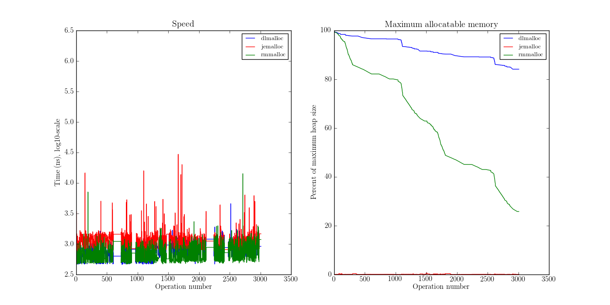

.. DOC: nifty table layout: http://tex.stackexchange.com/questions/102512/remove-vertical-line-in-tabular-head

Limitations
=======================================================
Both tcmalloc and jemalloc perform poorly without mmap. tcmalloc did not manage to finish for Opera with
TCMALLOC_SKIP_MMAP=1.

Input data
=============
Measuring an allocator must be done in conjunction with input data. These are the applications I've used.

* Opera v12.0 loading http://www.google.com
* LibreOffice 4.0.2.2 (soffice) and exiting
* sqlite 2.8.17 - ubuntu 13.04 - loading 17 MB phpBB3 [#]_ SQL data
* zip 3.0 - ubuntu 13.04 - compressing the contents of the gperftools distribution version 2.1 (6.2 MB)
* ls 8.20 - ubuntu 13.04 - displaying a directory
* cfrac 3.5.1 (3.51?) - just running it

.. TODO: Presented in tables. Explain headings.

The results are presented in charts and tables. I'll describe what they mean first, then give the resuts.

Speed chart.

* 

Size chart.

* 

Speed table.

*

Size table. In addition to the fields in speed table (applied to size, instead of speed), these fields are defined:

* 

.. [#] http://www.phpbb.com - a bulletin-board system

opera
=========
This is the largest input application of the examples used. (The opsfile is 8,4 Gb). As mentioned before (TODO: where?),
the full opsfile is only useful for lifetime calculations. An opsfile with complete locking/unlocking and malloc/free
information is significantly smaller.

See Figure :ref:`resultsopera`.

   :label:`resultsopera` Opera results. tcmalloc DNF.

.. raw:: latex

   \begin{table}
   \begin{tabular}{r | l c c r r}
   \hline
   \multicolumn{6}{c}{\bf Speed} \\
   \hline
   {\bf Driver} & {\bf Penalty (\textit{c}/\textit{w})} & {\bf Best} & {\bf Worst} & {\bf Average} & {\bf Median} \\
   \hline
   rmmalloc & 16\% / 7.28\% & 0.00\% & 9.37\% & 755 ns & 710 ns \\
   dlmalloc & 29\% / 14.29\% & 100.00\% & 22.26\% & 841 ns & 819 ns \\
   jemalloc & 54\% / 136.56\% & 0.00\% & 68.37\% & 2607 ns & 1116 ns \\
   \hline
   \end{tabular}
   \caption{Speed measurements for result-opera-google}
   \label{table:result-opera-google-speed}
   \end{table}

.. raw:: latex

   \begin{table}
   \begin{tabular}{r | l c c}
   \hline
   \multicolumn{4}{c}{\bf Space} \\
   \hline
   {\bf Driver} & {\bf Penalty (\textit{c}/\textit{w})} & {\bf Best} & {\bf Worst} \\
   \hline
   dlmalloc & 12\% / 3.66\% & 62.09\% & 100.00\% \\
   jemalloc & 29\% / 13.25\% & 37.81\% & 0.00\% \\
   rmmalloc & 57\% / 24.62\% & 0.10\% & 0.00\% \\
   \hline
   \end{tabular}
   \caption{Space measurements for result-opera-google}
   \label{table:result-opera-google-space}
   \end{table}

libreoffice
=============
.. figure:: allocstats/result-soffice.png
   :scale: 80%
   
   :label:`soffice` LibreOffice results. Poor performance of jemalloc.

.. raw:: latex

   \begin{table}
   \begin{tabular}{r | l c c r r}
   \hline
   \multicolumn{6}{c}{\bf Speed} \\
   \hline
   {\bf Driver} & {\bf Penalty (\textit{c}/\textit{w})} & {\bf Best} & {\bf Worst} & {\bf Average} & {\bf Median} \\
   \hline
   dlmalloc & 22\% / 8.90\% & 100.00\% & 5.87\% & 885 ns & 782 ns \\
   rmmalloc & 24\% / 8.92\% & 0.00\% & 6.09\% & 841 ns & 773 ns \\
   tcmalloc & 38\% / 80.14\% & 0.00\% & 15.43\% & 1559 ns & 859 ns \\
   jemalloc & 65\% / 282.56\% & 0.00\% & 72.61\% & 5450 ns & 1160 ns \\
   \hline
   \end{tabular}
   \caption{Speed measurements for result-soffice}
   \label{table:result-soffice-speed}
   \end{table}

.. raw:: latex

   \begin{table}
   \begin{tabular}{r | l c c}
   \hline
   \multicolumn{4}{c}{\bf Space} \\
   \hline
   {\bf Driver} & {\bf Penalty (\textit{c}/\textit{w})} & {\bf Best} & {\bf Worst} \\
   \hline
   tcmalloc & 0\% / 0.00\% & 100.00\% & 0.00\% \\
   dlmalloc & 29\% / 1.38\% & 0.00\% & 100.00\% \\
   rmmalloc & 45\% / 12.61\% & 0.00\% & 0.00\% \\
   jemalloc & 75\% / 70.87\% & 0.00\% & 0.00\% \\
   \hline
   \end{tabular}
   \caption{Space measurements for result-soffice}
   \label{table:result-soffice-space}
   \end{table}

.. See table :ref:`table:result-opera-google-space` for blarf.
.. See table :ref:`table:result-opera-google-speed` for glorf.

sqlite
=============

zip
============

ls
===============

cfrac
===============

latex
======
tcmalloc DNF

