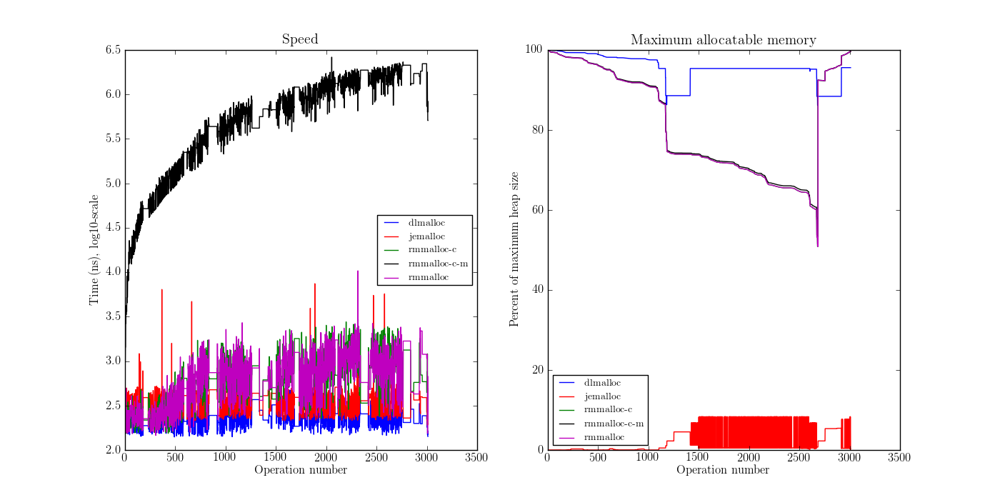

.. DOC: nifty table layout: http://tex.stackexchange.com/questions/102512/remove-vertical-line-in-tabular-head

.. raw:: latex

    \chapter{Results
        \label{chapter-results}}

Limitations
=======================================================
Both tcmalloc and jemalloc perform poorly with ``mmap()`` disabled, and in some cases they did not manage to finish allocation
simulation. In those cases the allocators are omitted from the results table. The first thing Steve does is to calculate
the maximum heap size used by the allocator for an application, by starting from the theoretical heap size for an ideal allocator and
increasing that value until no OOMs occur. If the limit on that increase is reached, the allocator is marked as *did not
finish*.

.. XXX: Wht is the _real_ purpose of the maximum heap size? Is there a point at all?

Input Data
=============
.. raw:: comment-gres-done

    X X X (gres)
    ~~~~~~~~~~
    misstänker att php-bb-databasen inte går att dela med sig, men övriga testdata? ett problem inom software engineering
    är att data är hemligt, och ju mer öppet data som går att få tag i, desto enklare är det att göra jämförande forskning
    eller replikeringar. (lägg till URL:er -micke)

Measuring an allocator must be done in conjunction with input data. These are the applications tested

* Opera v12.0 [#]_: load http://www.google.com and exit.
* StarOffice (LibreOffice) 4.0.2.2 [#]_: open a blank word processor document and exit.
* sqlite 2.8.17 (Ubuntu 13.04's default version) [#]_: load 17 MB phpBB3 [#]_ SQL data.
* ls 8.20 (Ubuntu 13.04's default version) [#]_: display the ``/bin`` directory.
* latex 3.1415926-2.4-1.40.13 [#]_: paper.tex (96 lines, 2.6 KB).
* GNU tar 1.27.1 (Ubuntu 13.04's default version) [#]_: compressing the contents of the Valgrind 3.9.0 source
  distribution (87 MB).

.. raw:: comment

    zip 3.0 (Ubuntu 13.04's default version) [#]_: compressing the contents of gperftools-2.1 [#]_ (6.2 MB).
    cfrac 3.5.1 - just running it.
    .. [#] http://www.info-zip.org
    .. [#] http://gperftools

.. [#] http://www.opera.com
.. [#] http://www.libreoffice.org
.. [#] http://www.sqlite.org
.. [#] http://www.phpbb.com - a bulletin-board system
.. [#] http://www.gnu.org/software/coreutils/
.. [#] http://www.latex-project.org
.. [#] https://www.gnu.org/software/tar/

The results are presented in charts and tables. I'll describe what they mean first, then give the results.

Keys To Read Charts and Tables
==================================
Drivers
~~~~~~~~
* **rmmalloc**: Jeff without compacting
* **rmmalloc-c**: Jeff with compacting
* **rmmalloc-c-m**: Jeff with compacting and maximum memory tweak

Charts
~~~~~~~
There are two types of charts, one of performance in time and one of performance in space.

Speed chart.

* **X axis**: A counter that is increased by one at each new, free, lock and unlock operation.
* **Y axis**: The execution time of the operation, on a *log10*-scale.

Size chart.

* **X axis**: Same as above.
* **Y axis**: The maximum allocatable amount of memory relative to the maximum heap size at each point in time, by
  running the application to that point, trying a maximum allocation and then restarting the application, continuing to to the
  next point.

Tables
~~~~~~~~~~~~
Scoring explained:

* Let :math:`A_1..A_n` be all allocators.
* Let :math:`O_1..O_m` be all operations in the application currently being measured.
* Let :math:`S_{ij}`` where :math:`i = 1..n, j = 1..m` be the score for the allocator :math:`i` at operation :math:`j`,
  such that :math:`S_{ij} \in {0..n}`, where 0 is the best result and *n* is the worst.
* Let :math:`P_i \in {0..1.0}` be the penalty of any allocator :math:`i \in A_1..A_n`, defined as :math:`P_i = \frac{1}{n * m}\sum_{j=1}^{m} S_{ij}`, where 0 is best and 1.0 is worst.
* Let :math:`B_i \in {A_1..A_n}` be the number of times the allocator :math:`i` has performed best.
* Let :math:`W_i \in {A_1..A_n}` be the number of times the allocator :math:`i` has performed worst.

..  comment
    The performance $P_a$ of any allocator $a$ in the allocators $A_1..A_n$ is ranked such that the best performing allocator is given the score $0$ and the worst
    is given the score $n$ as $S_am$, for each operation $O_0..O_m$.  Therefore, the best ranking an allocator can get is 0 and the the worst is
    $n*m$. The final score for allocator is simply the ratio between the sum of score for each operation and the worst
    possible ranking, i.e. $F_a = \frac{\sum\limits{o=1}^m S_ao}{n*m}$

Space table, sorted in descending order with best first.

* **Driver**: Name of the driver
* **Penalty (c)**: As given above.
* **Penalty (w)**: Score weighted by the distance to the lowest scoring allocator. Let :math:`b` be the best performing allocator, then :math:`Sw_{ij} = \frac{S_{ij} - S_{bj}}{S_{bj}}` where :math:`b` is the best performing allocator.
* **Best**: Ratio of :math:`\frac{B_i}{n} \in {0..1.0}`.
* **Worst**: Ratio of :math:`\frac{W_i}{n} \in {0..1.0}`.

Speed table, same sorting as the space table. In addition to the fields in speed table (applied to size, instead of speed), these fields are defined:

* **Average**: Average speed of all operations for a given allocator.
* **Median**: Median speed of all operations for a given allocator.

Penalty (c) can be considered to be the average internal ranking of an allocator, whereas penalty (w) shows the average internal weighted by the distance to the best allocator. Therefore, penalty (w) gives the reader a clue on the allocator's absolute performance, and it is also less smoothed out by simply averaging. An example of this can be seen in Table :ref:`table:result-soffice-speed` below.

All tables are sorted by penalty (c).

Results
=========
The results are very interesting in that there's a variation between the allocators, which of course is expected, but
also between the different applications tested, each with a unique memory usage patterns.  Two separate patterns can
be discerned when it comes to speed, with Figures :ref:`result-soffice`, :ref:`result-sqlite`, :ref:`result-ls` in one
group and :ref:`result-tar`, :ref:`result-latex`, :ref:`result-opera` in the other.

Something else to note is that jemalloc performs badly, very likely because of the limitation to only use *sbrk()* for
requesting memory from the operating system.

StarOffice
~~~~~~~~~~~~~~~
Command line used: ``soffice``

Simulated using full lockops.

.. figure:: allocstats/result-soffice.png
   :scale: 60%
   
   :label:`result-soffice` Soffice results. Poor performance of jemalloc.

.. raw:: latex

   \FloatBarrier   

The chart in Figure :ref:`result-soffice` clearly shows the space performance of the tested allocators, whereas the
speed chart is harder to read because of the similar speeds and the number of allocators tested. Tables :ref:`table:result-soffice-speed` and :ref:`table:result-soffice-space` are particularly useful here.

.. raw:: latex

   \begin{table}[!ht]
   \begin{tabular}{r | l c c r r}
   \hline
   \multicolumn{6}{c}{\bf Speed} \\
   \hline
   {\bf Driver} & {\bf Penalty (\textit{c}/\textit{w})} & {\bf Best} & {\bf Worst} & {\bf Average} & {\bf Median} \\
   \hline
   rmmalloc & 23\% / 18.30\% & 30.00\% & 3.22\% & 209 ns & 171 ns \\
   rmmalloc-c & 23\% / 15.80\% & 27.29\% & 1.69\% & 205 ns & 178 ns \\
   tcmalloc & 25\% / 54.76\% & 34.07\% & 6.44\% & 286 ns & 164 ns \\
   jemalloc & 47\% / 1378.68\% & 0.34\% & 10.00\% & 9751 ns & 228 ns \\
   dlmalloc & 54\% / 87.60\% & 8.14\% & 11.86\% & 372 ns & 370 ns \\
   rmmalloc-c-m & 75\% / 205.50\% & 0.17\% & 66.78\% & 562 ns & 483 ns \\
   \hline
   \end{tabular}
   \caption{Speed measurements for soffice}
   \label{table:result-soffice-speed}
   \end{table}

.. raw:: latex

   \begin{table}[!ht]
   \begin{tabular}{r | l c c}
   \hline
   \multicolumn{4}{c}{\bf Space} \\
   \hline
   {\bf Driver} & {\bf Penalty (\textit{c}/\textit{w})} & {\bf Best} & {\bf Worst} \\
   \hline
   tcmalloc & 0\% / 0.00\% & 100.00\% & 0.00\% \\
   dlmalloc & 28\% / 1.42\% & 0.00\% & 0.00\% \\
   rmmalloc-c-m & 29\% / 4.36\% & 0.00\% & 0.00\% \\
   rmmalloc & 46\% / 6.80\% & 0.00\% & 0.00\% \\
   rmmalloc-c & 62\% / 9.08\% & 0.00\% & 0.00\% \\
   jemalloc & 83\% / 78.88\% & 0.00\% & 100.00\% \\
   \hline
   \end{tabular}
   \caption{Space measurements for soffice}
   \label{table:result-soffice-space}
   \end{table}

.. raw:: latex

   \FloatBarrier   

As explained above, the penalty number by itself can be misleading. For example, in Table
:ref:`table:result-soffice-speed` we see that e.g. both *rmmalloc* and *rmmalloc-c* have the same penalty (c), but they
differ in other metrics. Which metric is more important depends on the application at hand. For certain applications, it
might be important that it performs predictably, in which case an allocator that has a high best *and* a high worst is a
bad choice.

The space metrics in Table :ref:`table:result-soffice-space` paints a clearer picture with two outliers, one in
*tcmalloc* performing better than all other allocators, and *jemalloc* performing worse than all other allocators.

.. raw:: latex

   \FloatBarrier   

.. raw:: latex

   \newpage{}

sqlite
~~~~~~~~~~
Command line used: ``sqlite < gkk_styrkelyft_se.sql``

Simulated using full lockops.

Results in Figure :ref:`result-sqlite`, Table :ref:`table:result-sqlite-speed` and Table :ref:`table:result-sqlite-space`.

.. figure:: allocstats/result-sqlite.png
   :scale: 60%
   
   :label:`result-sqlite` Sqlite results.

.. raw:: latex

   \FloatBarrier   

Again, bad performance of *jemalloc* in both measurements.

.. raw:: latex

   \begin{table}[!ht]
   \begin{tabular}{r | l c c r r}
   \hline
   \multicolumn{6}{c}{\bf Speed} \\
   \hline
   {\bf Driver} & {\bf Penalty (\textit{c}/\textit{w})} & {\bf Best} & {\bf Worst} & {\bf Average} & {\bf Median} \\
   \hline
   jemalloc & 14\% / 4726.79\% & 74.00\% & 5.60\% & 30152 ns & 0 ns \\
   rmmalloc-c & 30\% / 5718.10\% & 10.20\% & 1.40\% & 236 ns & 245 ns \\
   rmmalloc & 38\% / 8647.63\% & 6.00\% & 1.40\% & 262 ns & 257 ns \\
   tcmalloc & 42\% / 13830.88\% & 4.80\% & 28.40\% & 434 ns & 250 ns \\
   dlmalloc & 48\% / 10978.71\% & 4.20\% & 1.00\% & 286 ns & 272 ns \\
   rmmalloc-c-m & 75\% / 25289.42\% & 0.80\% & 62.20\% & 464 ns & 442 ns \\
   \hline
   \end{tabular}
   \caption{Speed measurements for sqlite}
   \label{table:result-sqlite-speed}
   \end{table}

.. raw:: latex

   \begin{table}[!ht]
   \begin{tabular}{r | l c c}
   \hline
   \multicolumn{4}{c}{\bf Space} \\
   \hline
   {\bf Driver} & {\bf Penalty (\textit{c}/\textit{w})} & {\bf Best} & {\bf Worst} \\
   \hline
   tcmalloc & 0\% / 0.00\% & 100.00\% & 0.00\% \\
   rmmalloc-c-m & 24\% / 8.14\% & 0.00\% & 0.00\% \\
   rmmalloc & 41\% / 13.22\% & 0.00\% & 0.00\% \\
   dlmalloc & 42\% / 9.59\% & 0.00\% & 0.00\% \\
   rmmalloc-c & 58\% / 18.02\% & 0.00\% & 0.00\% \\
   jemalloc & 83\% / 82.16\% & 0.00\% & 100.00\% \\
   \hline
   \end{tabular}
   \caption{Space measurements for sqlite}
   \label{table:result-sqlite-space}
   \end{table}

.. raw:: latex

   \FloatBarrier   

The speed table :ref:`table:result-sqlite-speed` is slightly confusing with regard to *jemalloc*, but can easily be understood if examined along with the
corresponding graph. In fact, it performs rather well, up until the point where it fails to work at all.  This also
skews the other allocator's penalty (w) numbers, which have to be viewed in relation to the base line which is
*jemalloc*. Adjusting the number, we instead get the following penalty (w) numbers:

* jemalloc 100
* rmmalloc-c: 120
* rmmalloc: 183
* tcmalloc: 292
* dlmalloc: 232
* rmmalloc-c-m: 530

As for the space table :ref:`table:result-sqlite-space`, *rmmalloc-c-m* which performed badly in speed instead performs
best when it comes to space. A better compromise between the two is *rmmalloc-c*, performing well in both space in time.

.. raw:: latex

   \newpage{}

ls
~~~~~~~~~~~~
Command line used: ``ls /bin``

Simulated using full lockops.

Results in Figure :ref:`result-ls`, Table :ref:`table:result-ls-speed` and Table :ref:`table:result-ls-space`.

.. figure:: allocstats/result-ls.png
   :scale: 60%
   
   :label:`result-ls` ls results.

.. raw:: latex

   \FloatBarrier   

The memory chart shows how memory allocation and memory use are split up in *ls*. First, it allocates data (op 0-40), then it operates on the data, does more allocation of "simpler" data sizes (a request that takes less time to serve, possibly by being of a size that can be handed out from a small objects pool or similar), followed by more data operations and finally a small allocation operation, most likely a free.  Again, *jemalloc* did not survive past the initial allocation operations.

.. raw:: latex

   \begin{table}[!ht]
   \begin{tabular}{r | l c c r r}
   \hline
   \multicolumn{6}{c}{\bf Speed} \\
   \hline
   {\bf Driver} & {\bf Penalty (\textit{c}/\textit{w})} & {\bf Best} & {\bf Worst} & {\bf Average} & {\bf Median} \\
   \hline
   jemalloc & 16\% / 1406.11\% & 73.75\% & 10.62\% & 20404 ns & 0 ns \\
   rmmalloc-c & 35\% / 25452.74\% & 14.38\% & 3.12\% & 752 ns & 776 ns \\
   rmmalloc & 35\% / 19559.69\% & 4.38\% & 2.50\% & 713 ns & 724 ns \\
   tcmalloc & 42\% / 22475.24\% & 2.50\% & 18.12\% & 1840 ns & 799 ns \\
   dlmalloc & 51\% / 39241.38\% & 5.00\% & 5.62\% & 1007 ns & 897 ns \\
   rmmalloc-c-m & 68\% / 56677.64\% & 0.00\% & 60.00\% & 982 ns & 1022 ns \\
   \hline
   \end{tabular}
   \caption{Speed measurements for ls}
   \label{table:result-ls-speed}
   \end{table}

.. raw:: latex

   \begin{table}[!ht]
   \begin{tabular}{r | l c c}
   \hline
   \multicolumn{4}{c}{\bf Space} \\
   \hline
   {\bf Driver} & {\bf Penalty (\textit{c}/\textit{w})} & {\bf Best} & {\bf Worst} \\
   \hline
   tcmalloc & 0\% / 0.00\% & 100.00\% & 0.00\% \\
   rmmalloc-c-m & 24\% / 5.83\% & 0.00\% & 0.00\% \\
   rmmalloc & 41\% / 9.35\% & 0.00\% & 0.00\% \\
   dlmalloc & 42\% / 6.00\% & 0.00\% & 0.00\% \\
   rmmalloc-c & 58\% / 12.74\% & 0.00\% & 0.00\% \\
   jemalloc & 83\% / 82.75\% & 0.00\% & 100.00\% \\
   \hline
   \end{tabular}
   \caption{Space measurements for ls}
   \label{table:result-ls-space}
   \end{table}

.. raw:: latex

   \FloatBarrier   

Starting with the speed table we see similarly to previous measurements where *jemalloc* failed early, that the absolute results
are skewed but the internal order is still correct. Good performance of *rmmalloc* but also of *tcmalloc* which has
differing results. As for memory efficiency, *tcmalloc* stands out after which the results for *rmmalloc* and *dlmalloc*
are very similar. *rmmalloc-c-m* fares slightly better, but is on the other hand very time consuming. This might not be
a trade-off the client code can make.

.. raw:: foo

    cfrac
    ===============
    ``$ cfrac 4758260277435811572216740001``

    Results in Figure :ref:`result-cfrac`, Table :ref:`table:result-cfrac-speed` and Table :ref:`table:result-cfrac-space`.

tar with bzip2 compression
~~~~~~~~~~~~~~~~~~~~~~~~~~~~~~~~
Command line used: ``tar cjf /tmp/valgrind-3.9.0.tar.bz2 /tmp/valgrind-3.9.0``

Simulated using full lockops.

Results in Figure :ref:`result-tar`, Table :ref:`table:result-tar-speed` and Table :ref:`table:result-tar-space`.

.. figure:: allocstats/result-tar.png
   :scale: 60%
   
   :label:`result-tar` tar cjf results.

.. raw:: latex

   \FloatBarrier   

For the linearly growing allocation pattern used in tar,  *rmalloc-c-m* does not fare well with its exponential
algorithm. The others are segmented, with *dlmalloc* coming out as the fastest, followed by *rmmalloc*.  As for memory
efficiency, *dlmalloc* is the clear winner here.

.. raw:: latex

   \begin{table}[!ht]
   \begin{tabular}{r | l c c r r}
   \hline
   \multicolumn{6}{c}{\bf Speed} \\
   \hline
   {\bf Driver} & {\bf Penalty (\textit{c}/\textit{w})} & {\bf Best} & {\bf Worst} & {\bf Average} & {\bf Median} \\
   \hline
   dlmalloc & 15\% / 5.73\% & 50.96\% & 0.00\% & 233 ns & 235 ns \\
   rmmalloc-c & 26\% / 12.71\% & 23.06\% & 0.00\% & 257 ns & 258 ns \\
   rmmalloc & 26\% / 12.06\% & 23.19\% & 0.00\% & 256 ns & 256 ns \\
   jemalloc & 50\% / 100.08\% & 2.79\% & 0.37\% & 1228 ns & 365 ns \\
   rmmalloc-c-m & 79\% / 15087.61\% & 0.00\% & 99.63\% & 36592 ns & 34975 ns \\
   \hline
   \end{tabular}
   \caption{Speed measurements for tar}
   \label{table:result-tar-speed}
   \end{table}

.. raw:: latex

   \begin{table}[!ht]
   \begin{tabular}{r | l c c}
   \hline
   \multicolumn{4}{c}{\bf Space} \\
   \hline
   {\bf Driver} & {\bf Penalty (\textit{c}/\textit{w})} & {\bf Best} & {\bf Worst} \\
   \hline
   dlmalloc & 0\% / 0.00\% & 99.93\% & 0.00\% \\
   rmmalloc-c-m & 19\% / 5.15\% & 0.07\% & 0.00\% \\
   rmmalloc & 39\% / 10.49\% & 0.00\% & 0.00\% \\
   rmmalloc-c & 59\% / 15.74\% & 0.00\% & 0.00\% \\
   jemalloc & 80\% / 79.89\% & 0.00\% & 100.00\% \\
   \hline
   \end{tabular}
   \caption{Space measurements for tar}
   \label{table:result-tar-space}
   \end{table}

.. raw:: latex

   \FloatBarrier   

There are no real surprises in speed in Table :ref:`table:result-tar-speed`, since the graphs are easy to interpret
directly.  Here it's important to note that even though the space numbers in Table :ref:`table:result-tar-space` look
good enough for the *rmmalloc* allocator (and variants), it's still performs a lot worse than *dlmalloc*. It is not
sufficient to look only at the numbers.

.. raw:: latex

   \newpage{}

latex
~~~~~~~~~~~~~~~~
Command line used: ``latex paper.tex``

Simulated using full lockops.

Results in Figure :ref:`result-latex`, Table :ref:`table:result-latex-speed` and Table :ref:`table:result-latex-space`
(tcmalloc did not finish).

.. figure:: allocstats/result-latex.png
   :scale: 60%
   
   :label:`result-latex` latex results.

.. raw:: latex

   \FloatBarrier   

A very simple linear allocation pattern, where we clearly see the time inefficiency of *rmalloc-c-m* because of its
exponential search. It does however fare well when it comes to space.  Even *rmalloc-c* which has fairly good
performance in time still has a exponential tendency whereas *dlmalloc* is mostly linear.  Here's a case where the
trade-off might not be worth it, especially since *dlmalloc* performs better in both areas. 

.. raw:: latex

   \begin{table}[!ht]
   \begin{tabular}{r | l c c r r}
   \hline
   \multicolumn{6}{c}{\bf Speed} \\
   \hline
   {\bf Driver} & {\bf Penalty (\textit{c}/\textit{w})} & {\bf Best} & {\bf Worst} & {\bf Average} & {\bf Median} \\
   \hline
   dlmalloc & 1\% / 1.54\% & 93.49\% & 0.00\% & 167 ns & 152 ns \\
   jemalloc & 23\% / 65.43\% & 4.65\% & 0.03\% & 621 ns & 224 ns \\
   rmmalloc-c & 46\% / 122.33\% & 1.13\% & 0.00\% & 523 ns & 428 ns \\
   rmmalloc & 47\% / 124.81\% & 0.73\% & 0.00\% & 530 ns & 417 ns \\
   rmmalloc-c-m & 79\% / 189701.98\% & 0.00\% & 99.97\% & 372546 ns & 268695 ns \\
   \hline
   \end{tabular}
   \caption{Speed measurements for latex}
   \label{table:result-latex-speed}
   \end{table}

.. raw:: latex

   \begin{table}[!ht]
   \begin{tabular}{r | l c c}
   \hline
   \multicolumn{4}{c}{\bf Space} \\
   \hline
   {\bf Driver} & {\bf Penalty (\textit{c}/\textit{w})} & {\bf Best} & {\bf Worst} \\
   \hline
   dlmalloc & 0\% / 0.00\% & 99.93\% & 0.00\% \\
   rmmalloc-c-m & 19\% / 0.72\% & 0.03\% & 0.00\% \\
   rmmalloc & 39\% / 1.60\% & 0.00\% & 0.00\% \\
   rmmalloc-c & 59\% / 2.40\% & 0.03\% & 0.00\% \\
   jemalloc & 80\% / 80.00\% & 0.00\% & 100.00\% \\
   \hline
   \end{tabular}
   \caption{Space measurements for latex}
   \label{table:result-latex-space}
   \end{table}

.. raw:: latex

   \FloatBarrier   

No surprises here since the graphs are easy to read for this test case.

.. raw:: latex

   \newpage{}

opera
~~~~~~~~~~~~~
Command line used: ``opera``

Due to memory/CPU constraints, I was not able to perform a locking data calculation. The results are therefore without
any locking/unlocking, which means that any compacting operations are optimal (no locked blocks).

Results in Figure :ref:`result-opera`, Table :ref:`table:result-opera-blank2-speed` and Table :ref:`table:result-opera-blank2-space`.

   :label:`result-opera` Opera results.

.. raw:: latex

   \FloatBarrier   

We see the same characteristics as in the LaTeX test above, except for the ranges where no allocation operations happen.
*jemalloc* performs well speed-wise but badly in available space. 

.. raw:: latex

   \begin{table}[!ht]
   \begin{tabular}{r | l c c r r}
   \hline
   \multicolumn{6}{c}{\bf Speed} \\
   \hline
   {\bf Driver} & {\bf Penalty (\textit{c}/\textit{w})} & {\bf Best} & {\bf Worst} & {\bf Average} & {\bf Median} \\
   \hline
   dlmalloc & 4\% / 1.75\% & 83.19\% & 0.00\% & 239 ns & 233 ns \\
   jemalloc & 26\% / 125.39\% & 9.37\% & 0.03\% & 1000 ns & 372 ns \\
   rmmalloc-c & 44\% / 124.86\% & 2.82\% & 0.00\% & 752 ns & 632 ns \\
   rmmalloc & 44\% / 132.46\% & 4.62\% & 0.00\% & 779 ns & 704 ns \\
   rmmalloc-c-m & 79\% / 310598.14\% & 0.00\% & 99.97\% & 861988 ns & 687897 ns \\
   \hline
   \end{tabular}
   \caption{Speed measurements for opera}
   \label{table:result-opera-blank2-speed}
   \end{table}

.. raw:: latex

   \begin{table}[!ht]
   \begin{tabular}{r | l c c}
   \hline
   \multicolumn{4}{c}{\bf Space} \\
   \hline
   {\bf Driver} & {\bf Penalty (\textit{c}/\textit{w})} & {\bf Best} & {\bf Worst} \\
   \hline
   dlmalloc & 6\% / 0.36\% & 89.20\% & 0.00\% \\
   rmmalloc-c-m & 19\% / 2.88\% & 0.03\% & 0.00\% \\
   rmmalloc & 35\% / 5.88\% & 0.00\% & 0.00\% \\
   rmmalloc-c & 57\% / 8.82\% & 10.76\% & 0.00\% \\
   jemalloc & 80\% / 78.51\% & 0.00\% & 100.00\% \\
   \hline
   \end{tabular}
   \caption{Space measurements for opera}
   \label{table:result-opera-blank2-space}
   \end{table}

.. raw:: latex

   \FloatBarrier   

Again, skewed results because of *jemalloc*. By far fastest and most space-efficient is *dlmalloc* in this type of
scenario.

.. raw:: latex

   \newpage{}

