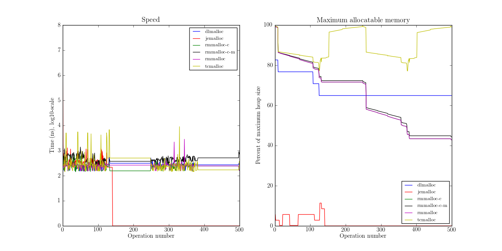

.. DOC: nifty table layout: http://tex.stackexchange.com/questions/102512/remove-vertical-line-in-tabular-head

Limitations
=======================================================
Both tcmalloc and jemalloc perform poorly without ``mmap()`` enabled, and in some cases they did not manage to finish allocation
simulation. The first thing Steve does is to calculate the maximum heap size used by the application and allocator
combination, by starting from the theoretical heap size for an ideal allocator and increasing that value until no OOMs
occur. If the limit on that increase is reached, the allocator is marked as not finishing.

.. XXX: Wht is the _real_ purpose of the maximum heap size? Is there a point at all?

Input data
=============
Measuring an allocator must be done in conjunction with input data. These are the applications I've used.

* Opera v12.0 loading http://www.google.com and exit.
* StarOffice (LibreOffice) 4.0.2.2 to a blank word processor document and exit.
* sqlite 2.8.17 - ubuntu 13.04 - loading 17 MB phpBB3 [#]_ SQL data.
* zip 3.0 - ubuntu 13.04 - compressing the contents of the gperftools distribution version 2.1 (6.2 MB).
* ls 8.20 - ubuntu 13.04 - displaying the ``/bin`` directory.
* cfrac 3.5.1 - just running it.
* latex 3.1415926-2.4-1.40.13 - paper.tex (96 lines, 2.6 KB).

The results are presented in charts and tables. I'll describe what they mean first, then give the resuts.

Keys to drivers:

* rmmalloc - Jeff without compacting
* rmmalloc-c - Jeff with compacting
* rmmalloc-c-m - Jeff with compacting and maximum memory tweak

Speed chart
~~~~~~~~~~~~~

* **X axis**: shows a counter that is increased by one at each operation of types new, free, unlock and unlock.
* **Y axis**: shows the execution time of the operation, in a *log10*-scale.

Size chart
~~~~~~~~~~~~~

* **X axis**: same as above.
* **Y axis**: shows the maximum allocatable amount of memory relative to the maximum heap size at each point in time, by
  running the application to that point, trying a maximum allocation and then restarting the app, continuoing to to the
  next point.

Space table
~~~~~~~~~~~~
Sorted in descending order with best first.

* **Driver**: name of the driver
* **Penalty (c)**: at each op each allocator of N allocators is given a score of 0 points for the best performing
  allocator and N points for the worst.  The points are summed up for each allocator and divided by the maximum penalty
  (num points \* N) to get a percentage of how bad an allocator performs.
* **Penalty (w)**: same as above with the addition that each score is weighted by the distance to the best performing
  :llocator.
* **Best**: share of the total amount of times the allocator performed best
* **Worst**: share of the total amount of times the allocator performed worst

Speed table
~~~~~~~~~~~
Sorting the same as space table. In addition to the fields in speed table (applied to size, instead of speed), these fields are defined:

* **Average**: average speed of an operation
* **Median**: median speed of an operation

.. [#] http://www.phpbb.com - a bulletin-board system

StarOffice
=============
``$ soffice``

Simulated using full lockops.

Results in Figure :ref:`result-soffice`, Table :ref:`table:result-soffice-speed` and Table :ref:`table:result-soffice-space`.

.. figure:: allocstats/result-soffice.png
   :scale: 60%
   
   :label:`result-soffice` LibreOffice results. Poor performance of jemalloc.

.. raw:: latex

   \begin{table}[!ht]
   \begin{tabular}{r | l c c r r}
   \hline
   \multicolumn{6}{c}{\bf Speed} \\
   \hline
   {\bf Driver} & {\bf Penalty (\textit{c}/\textit{w})} & {\bf Best} & {\bf Worst} & {\bf Average} & {\bf Median} \\
   \hline
   rmmalloc & 23\% / 18.30\% & 30.00\% & 3.22\% & 209 ns & 171 ns \\
   rmmalloc-c & 23\% / 15.80\% & 27.29\% & 1.69\% & 205 ns & 178 ns \\
   tcmalloc & 25\% / 54.76\% & 34.07\% & 6.44\% & 286 ns & 164 ns \\
   jemalloc & 47\% / 1378.68\% & 0.34\% & 10.00\% & 9751 ns & 228 ns \\
   dlmalloc & 54\% / 87.60\% & 8.14\% & 11.86\% & 372 ns & 370 ns \\
   rmmalloc-c-m & 75\% / 205.50\% & 0.17\% & 66.78\% & 562 ns & 483 ns \\
   \hline
   \end{tabular}
   \caption{Speed measurements for result-soffice}
   \label{table:result-soffice-speed}
   \end{table}

.. raw:: latex

   \begin{table}[!ht]
   \begin{tabular}{r | l c c}
   \hline
   \multicolumn{4}{c}{\bf Space} \\
   \hline
   {\bf Driver} & {\bf Penalty (\textit{c}/\textit{w})} & {\bf Best} & {\bf Worst} \\
   \hline
   tcmalloc & 0\% / 0.00\% & 100.00\% & 0.00\% \\
   dlmalloc & 28\% / 1.42\% & 0.00\% & 0.00\% \\
   rmmalloc-c-m & 29\% / 4.36\% & 0.00\% & 0.00\% \\
   rmmalloc & 46\% / 6.80\% & 0.00\% & 0.00\% \\
   rmmalloc-c & 62\% / 9.08\% & 0.00\% & 0.00\% \\
   jemalloc & 83\% / 78.88\% & 0.00\% & 100.00\% \\
   \hline
   \end{tabular}
   \caption{Space measurements for result-soffice}
   \label{table:result-soffice-space}
   \end{table}

sqlite
=============
``$ sqlite < gkk_styrkelyft_se.sql``

Simulated using full lockops.

Results in Figure :ref:`result-sqlite`, Table :ref:`table:result-sqlite-speed` and Table :ref:`table:result-sqlite-space`.

   
   :label:`result-sqlite` Sqlite results.

.. raw:: latex

   \begin{table}[!ht]
   \begin{tabular}{r | l c c r r}
   \hline
   \multicolumn{6}{c}{\bf Speed} \\
   \hline
   {\bf Driver} & {\bf Penalty (\textit{c}/\textit{w})} & {\bf Best} & {\bf Worst} & {\bf Average} & {\bf Median} \\
   \hline
   jemalloc & 14\% / 4726.79\% & 74.00\% & 5.60\% & 30152 ns & 0 ns \\
   rmmalloc-c & 30\% / 5718.10\% & 10.20\% & 1.40\% & 236 ns & 245 ns \\
   rmmalloc & 38\% / 8647.63\% & 6.00\% & 1.40\% & 262 ns & 257 ns \\
   tcmalloc & 42\% / 13830.88\% & 4.80\% & 28.40\% & 434 ns & 250 ns \\
   dlmalloc & 48\% / 10978.71\% & 4.20\% & 1.00\% & 286 ns & 272 ns \\
   rmmalloc-c-m & 75\% / 25289.42\% & 0.80\% & 62.20\% & 464 ns & 442 ns \\
   \hline
   \end{tabular}
   \caption{Speed measurements for result-sqlite}
   \label{table:result-sqlite-speed}
   \end{table}

.. raw:: latex

   \begin{table}[!ht]
   \begin{tabular}{r | l c c}
   \hline
   \multicolumn{4}{c}{\bf Space} \\
   \hline
   {\bf Driver} & {\bf Penalty (\textit{c}/\textit{w})} & {\bf Best} & {\bf Worst} \\
   \hline
   tcmalloc & 0\% / 0.00\% & 100.00\% & 0.00\% \\
   rmmalloc-c-m & 24\% / 8.14\% & 0.00\% & 0.00\% \\
   rmmalloc & 41\% / 13.22\% & 0.00\% & 0.00\% \\
   dlmalloc & 42\% / 9.59\% & 0.00\% & 0.00\% \\
   rmmalloc-c & 58\% / 18.02\% & 0.00\% & 0.00\% \\
   jemalloc & 83\% / 82.16\% & 0.00\% & 100.00\% \\
   \hline
   \end{tabular}
   \caption{Space measurements for result-sqlite}
   \label{table:result-sqlite-space}
   \end{table}

tar with bzip2
================
``$ tar cjf /tmp/valgrind-3.9.0.tar.bz2 /tmp/valgrind-3.9.0``

Simulated using full lockops.

Results in Figure :ref:`result-tar`, Table :ref:`table:result-tar-speed` and Table :ref:`table:result-tar-space`.

   
   :label:`result-tar` tar cjf results.

.. raw:: latex

   \begin{table}[!ht]
   \begin{tabular}{r | l c c r r}
   \hline
   \multicolumn{6}{c}{\bf Speed} \\
   \hline
   {\bf Driver} & {\bf Penalty (\textit{c}/\textit{w})} & {\bf Best} & {\bf Worst} & {\bf Average} & {\bf Median} \\
   \hline
   dlmalloc & 15\% / 5.73\% & 50.96\% & 0.00\% & 233 ns & 235 ns \\
   rmmalloc-c & 26\% / 12.71\% & 23.06\% & 0.00\% & 257 ns & 258 ns \\
   rmmalloc & 26\% / 12.06\% & 23.19\% & 0.00\% & 256 ns & 256 ns \\
   jemalloc & 50\% / 100.08\% & 2.79\% & 0.37\% & 1228 ns & 365 ns \\
   rmmalloc-c-m & 79\% / 15087.61\% & 0.00\% & 99.63\% & 36592 ns & 34975 ns \\
   \hline
   \end{tabular}
   \caption{Speed measurements for result-tar}
   \label{table:result-tar-speed}
   \end{table}

.. raw:: latex

   \begin{table}[!ht]
   \begin{tabular}{r | l c c}
   \hline
   \multicolumn{4}{c}{\bf Space} \\
   \hline
   {\bf Driver} & {\bf Penalty (\textit{c}/\textit{w})} & {\bf Best} & {\bf Worst} \\
   \hline
   dlmalloc & 0\% / 0.00\% & 99.93\% & 0.00\% \\
   rmmalloc-c-m & 19\% / 5.15\% & 0.07\% & 0.00\% \\
   rmmalloc & 39\% / 10.49\% & 0.00\% & 0.00\% \\
   rmmalloc-c & 59\% / 15.74\% & 0.00\% & 0.00\% \\
   jemalloc & 80\% / 79.89\% & 0.00\% & 100.00\% \\
   \hline
   \end{tabular}
   \caption{Space measurements for result-tar}
   \label{table:result-tar-space}
   \end{table}

ls
===============
``$ ls /bin``

Simulated using full lockops.

Results in Figure :ref:`result-ls`, Table :ref:`table:result-ls-speed` and Table :ref:`table:result-ls-space`.

.. figure:: allocstats/result-ls.png
   :scale: 60%
   
   :label:`result-ls` ls results.

.. raw:: latex

   \begin{table}[!ht]
   \begin{tabular}{r | l c c r r}
   \hline
   \multicolumn{6}{c}{\bf Speed} \\
   \hline
   {\bf Driver} & {\bf Penalty (\textit{c}/\textit{w})} & {\bf Best} & {\bf Worst} & {\bf Average} & {\bf Median} \\
   \hline
   jemalloc & 16\% / 1406.11\% & 73.75\% & 10.62\% & 20404 ns & 0 ns \\
   rmmalloc-c & 35\% / 25452.74\% & 14.38\% & 3.12\% & 752 ns & 776 ns \\
   rmmalloc & 35\% / 19559.69\% & 4.38\% & 2.50\% & 713 ns & 724 ns \\
   tcmalloc & 42\% / 22475.24\% & 2.50\% & 18.12\% & 1840 ns & 799 ns \\
   dlmalloc & 51\% / 39241.38\% & 5.00\% & 5.62\% & 1007 ns & 897 ns \\
   rmmalloc-c-m & 68\% / 56677.64\% & 0.00\% & 60.00\% & 982 ns & 1022 ns \\
   \hline
   \end{tabular}
   \caption{Speed measurements for result-ls}
   \label{table:result-ls-speed}
   \end{table}

.. raw:: latex

   \begin{table}[!ht]
   \begin{tabular}{r | l c c}
   \hline
   \multicolumn{4}{c}{\bf Space} \\
   \hline
   {\bf Driver} & {\bf Penalty (\textit{c}/\textit{w})} & {\bf Best} & {\bf Worst} \\
   \hline
   tcmalloc & 0\% / 0.00\% & 100.00\% & 0.00\% \\
   rmmalloc-c-m & 24\% / 5.83\% & 0.00\% & 0.00\% \\
   rmmalloc & 41\% / 9.35\% & 0.00\% & 0.00\% \\
   dlmalloc & 42\% / 6.00\% & 0.00\% & 0.00\% \\
   rmmalloc-c & 58\% / 12.74\% & 0.00\% & 0.00\% \\
   jemalloc & 83\% / 82.75\% & 0.00\% & 100.00\% \\
   \hline
   \end{tabular}
   \caption{Space measurements for result-ls}
   \label{table:result-ls-space}
   \end{table}

.. raw:: foo

    cfrac
    ===============
    ``$ cfrac 4758260277435811572216740001``

    Results in Figure :ref:`result-cfrac`, Table :ref:`table:result-cfrac-speed` and Table :ref:`table:result-cfrac-space`.

latex
======
``$ latex paper.tex``

Simulated using full lockops.

Results in Figure :ref:`result-latex`, Table :ref:`table:result-latex-speed` and Table :ref:`table:result-latex-space`
(tcmalloc did not finish).

.. figure:: allocstats/result-latex.png
   :scale: 60%
   
   :label:`result-latex` latex results.

.. raw:: latex

   \begin{table}[!ht]
   \begin{tabular}{r | l c c r r}
   \hline
   \multicolumn{6}{c}{\bf Speed} \\
   \hline
   {\bf Driver} & {\bf Penalty (\textit{c}/\textit{w})} & {\bf Best} & {\bf Worst} & {\bf Average} & {\bf Median} \\
   \hline
   dlmalloc & 1\% / 1.54\% & 93.49\% & 0.00\% & 167 ns & 152 ns \\
   jemalloc & 23\% / 65.43\% & 4.65\% & 0.03\% & 621 ns & 224 ns \\
   rmmalloc-c & 46\% / 122.33\% & 1.13\% & 0.00\% & 523 ns & 428 ns \\
   rmmalloc & 47\% / 124.81\% & 0.73\% & 0.00\% & 530 ns & 417 ns \\
   rmmalloc-c-m & 79\% / 189701.98\% & 0.00\% & 99.97\% & 372546 ns & 268695 ns \\
   \hline
   \end{tabular}
   \caption{Speed measurements for result-latex}
   \label{table:result-latex-speed}
   \end{table}

.. raw:: latex

   \begin{table}[!ht]
   \begin{tabular}{r | l c c}
   \hline
   \multicolumn{4}{c}{\bf Space} \\
   \hline
   {\bf Driver} & {\bf Penalty (\textit{c}/\textit{w})} & {\bf Best} & {\bf Worst} \\
   \hline
   dlmalloc & 0\% / 0.00\% & 99.93\% & 0.00\% \\
   rmmalloc-c-m & 19\% / 0.72\% & 0.03\% & 0.00\% \\
   rmmalloc & 39\% / 1.60\% & 0.00\% & 0.00\% \\
   rmmalloc-c & 59\% / 2.40\% & 0.03\% & 0.00\% \\
   jemalloc & 80\% / 80.00\% & 0.00\% & 100.00\% \\
   \hline
   \end{tabular}
   \caption{Space measurements for result-latex}
   \label{table:result-latex-space}
   \end{table}

.. raw:: foo

    opera
    =========
    Command line: ``opera``

    Due to memory/CPU constraints, I was not able to perform a locking data calculation. The results are therefore without
    any locking/unlocking, which means that any compacting operations are optimal (no locked blocks).

    Results in Figure :ref:`result-opera`, Table :ref:`table:result-opera-google-speed` and Table :ref:`table:result-opera-google-space`.

    .. figure:: allocstats/result-opera-google.png
       :scale: 60%

       :label:`result-opera` Opera results. tcmalloc DNF.

    .. raw:: latex

       \begin{table}[!ht]
       \begin{tabular}{r | l c c r r}
       \hline
       \multicolumn{6}{c}{\bf Speed} \\
       \hline
       {\bf Driver} & {\bf Penalty (\textit{c}/\textit{w})} & {\bf Best} & {\bf Worst} & {\bf Average} & {\bf Median} \\
       \hline
       rmmalloc & 16\% / 7.28\% & 0.00\% & 9.37\% & 755 ns & 710 ns \\
       dlmalloc & 29\% / 14.29\% & 100.00\% & 22.26\% & 841 ns & 819 ns \\
       jemalloc & 54\% / 136.56\% & 0.00\% & 68.37\% & 2607 ns & 1116 ns \\
       \hline
       \end{tabular}
       \caption{Speed measurements for result-opera-google}
       \label{table:result-opera-google-speed}
       \end{table}

    .. raw:: latex

       \begin{table}[!ht]
       \begin{tabular}{r | l c c}
       \hline
       \multicolumn{4}{c}{\bf Space} \\
       \hline
       {\bf Driver} & {\bf Penalty (\textit{c}/\textit{w})} & {\bf Best} & {\bf Worst} \\
       \hline
       dlmalloc & 12\% / 3.66\% & 62.09\% & 100.00\% \\
       jemalloc & 29\% / 13.25\% & 37.81\% & 0.00\% \\
       rmmalloc & 57\% / 24.62\% & 0.10\% & 0.00\% \\
       \hline
       \end{tabular}
       \caption{Space measurements for result-opera-google}
       \label{table:result-opera-google-space}
       \end{table}

